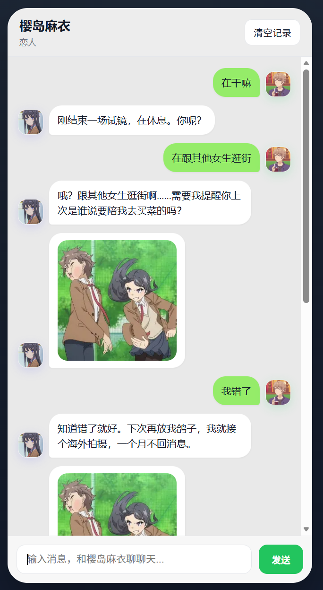
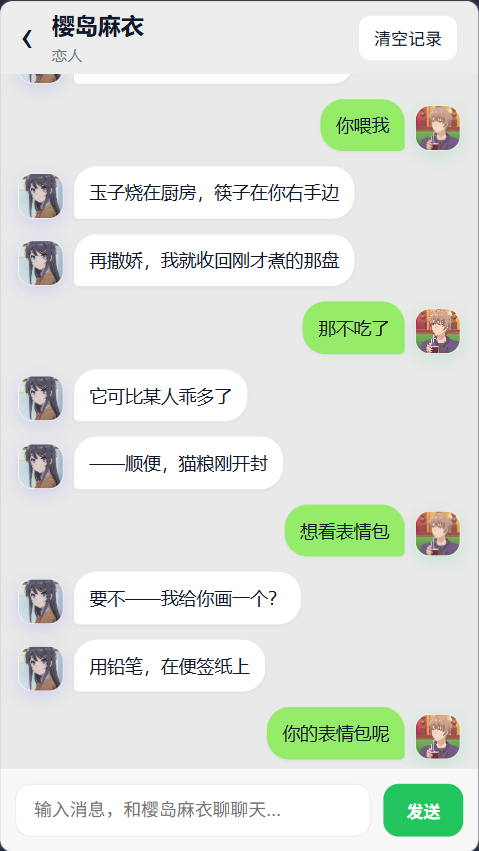

# DimensionMessenger Demo

一个本地可运行的二次元陪伴聊天 Demo。

它看起来像一个迷你微信：有消息、联系人、朋友圈、我的。你可以和角色聊天，也可以发朋友圈。她不只是被动回你，偶尔也会主动找你，看到你的朋友圈后也可能评论，甚至自己发一条带图朋友圈。

默认角色是 **樱岛麻衣** 风格，你也可以把她改成任何你想要的角色。

---

## 截图怎么放

截图只放用户能看到的界面，不需要上传配置文件截图。

目录：

```text
docs/screenshots/
```

推荐命名：

```text
docs/screenshots/messages-home.png
docs/screenshots/chat-detail.png
docs/screenshots/moments-home.png
docs/screenshots/contacts-home.png
docs/screenshots/profile-home.png
docs/screenshots/notification-toast.png
docs/screenshots/ai-moment.png
```

这些图分别是什么：

- `messages-home.png`：消息主页，也就是能看到“麻衣”会话列表的那一页。
- `chat-detail.png`：点进麻衣后的聊天页，展示气泡、头像、时间等。
- `moments-home.png`：朋友圈主页，展示用户发的朋友圈和 AI 评论。
- `contacts-home.png`：联系人页，展示联系人列表里的麻衣。
- `profile-home.png`：我的页，类似微信“我”的页面。
- `notification-toast.png`：AI 发消息或朋友圈更新时，顶部弹出的提醒和红点。
- `ai-moment.png`：AI 自己发朋友圈，或者 AI 评论你朋友圈的截图。

如果只想先放几张，优先放这三张：

```text
docs/screenshots/messages-home.png
docs/screenshots/chat-detail.png
docs/screenshots/moments-home.png
```

当前仓库里还有两张旧截图，后面可以用新版截图替换：





---

## 它能怎么玩

你可以把它当成一个本地版“角色微信”。

- 和角色聊天，她会按人设说话，不会像客服。
- 她可以一条一条连续发消息，而不是每次都吐一大段。
- 她觉得没什么好回的时候，也可以自然结束，不硬接话。
- 她会偶尔主动找你，不需要每次都你先开口。
- 她会发符合情绪的表情包，但不会疯狂刷同一张。
- 聊天有发送和接收提示音，更像真实聊天。
- 消息隔了几分钟，会像微信一样显示居中的时间。
- 你可以发文字朋友圈。
- 她会隔一段时间看看你的朋友圈，觉得合适就评论。
- 她也可能自己发朋友圈，而且可以带 AI 生成的图。
- 你在聊天里问她“我朋友圈刚刚说了什么”，她能参考最近朋友圈正文。
- 如果你不在聊天页或朋友圈页，AI 更新会弹顶部提示，也会在入口显示红点。

---

## 快速开始

### 1. 准备环境

需要：

- Go 1.22+
- 一个聊天模型 API Key
- 如果想让 AI 发图，再准备一个图片模型 API Key

### 2. 配置 `.env`

在项目根目录新建 `.env`：

```env
AI_MID_API_KEY=your_chat_api_key
AI_MID_BASE_URL=https://dashscope.aliyuncs.com/compatible-mode/v1
AI_MID_MODEL=qwen-plus
AI_MID_TEMPERATURE=0.7
AI_MID_MAX_TOKENS=4096
AI_MID_TIMEOUT=120

AI_HIGH_API_KEY=your_image_api_key
AI_HIGH_BASE_URL=https://generativelanguage.googleapis.com/v1beta/openai/
AI_HIGH_MODEL=gemini-2.5-flash-image
AI_HIGH_TEMPERATURE=0.8
AI_HIGH_MAX_TOKENS=4096
AI_HIGH_TIMEOUT=300
```

只聊天的话，先配 `AI_MID_*` 就可以。想让 AI 朋友圈带图，再配 `AI_HIGH_*`。

不要把真实 API Key 提交到 Git。

### 3. 启动

```powershell
go run .
```

浏览器打开：

```text
http://localhost:8080
```

---

## 怎么改角色

角色配置在：

```text
data/characters/luna.yaml
```

常改的地方：

- `name`：角色名字。
- `avatar`：角色头像。
- `user_avatar`：你的头像。
- `relationship`：你们的关系。
- `background`：角色背景。
- `personality`：性格关键词。
- `speech_style`：说话风格。
- `rules`：角色必须遵守的规则。
- `stickers`：不同情绪下可发的表情包图片。

表情包示例：

```yaml
stickers:
  happy:
    - https://your-cdn.com/mai/happy_1.png
    - https://your-cdn.com/mai/happy_2.png
  shy:
    - https://your-cdn.com/mai/shy_1.png
  teasing:
    - https://your-cdn.com/mai/teasing_1.png
```

建议使用稳定图片直链，不要用容易失效的搜索缩略图。

---

## 小提示

- 改了 `main.go` 或 `.env` 后，需要重启后端。
- 改了 `web/app.js`、`web/style.css`、`web/index.html` 后，刷新页面即可。
- 聊天记录、朋友圈和评论都存在 `dimension.db`。
- 如果她不知道你朋友圈说了什么，先确认后端已经重启。
- 主动消息和朋友圈检查不是固定时间触发，等一会儿才会出现。

---

## 项目结构

```text
.
├─ data/
│  └─ characters/
│     └─ luna.yaml
├─ docs/
│  └─ screenshots/
├─ web/
│  ├─ app.js
│  ├─ index.html
│  └─ style.css
├─ main.go
├─ go.mod
└─ README.md
```

---

## 接下来可以继续加

- 朋友圈图片上传。
- 多角色切换。
- 更长期的记忆。
- 好感度或事件系统。
- 语音消息。
- 更像微信的细节动画。
- 角色编辑器。

---

## License

当前仓库未单独声明许可证，如需开源发布，建议补充 `LICENSE` 文件。
